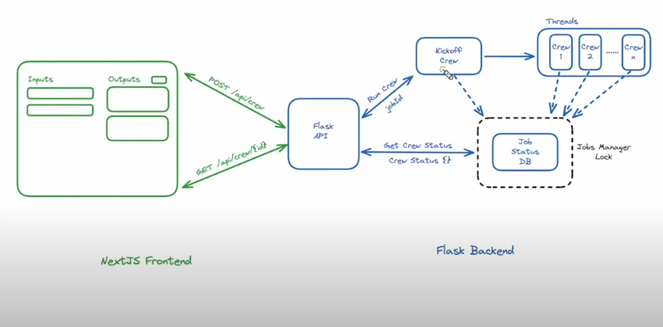

# Welcome to the NextJS CrewAI Full Stack Tutorial
To see how to build and run this fullstack application, checkout the step-by-step YouTube tutorial here: https://youtu.be/d8juNbo3onk

Create an .env file in crew_be with:
YOUTUBE_API_KEY=
OPENAI_API_KEY=
SERPER_API_KEY=

Quickstart:

cd crew_be
poetry install --no-root
poetry shell
make sure IDE is using the poetry shell interpreter path 
python api.py # should start the crew_be server 

cd nextjs_app
npm i
npm run dev # should be good to go 

